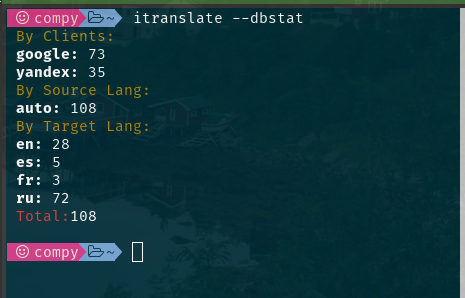
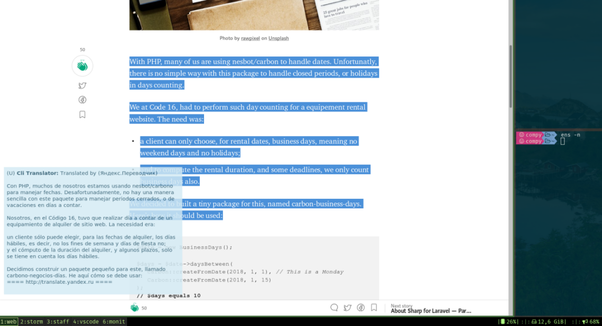
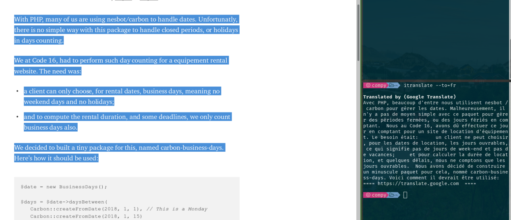

Console Translator
==================

### Installation

`pip3 install cli_translate --user`

### Features

 - Quick translation for text in clipboard

 - Ability for replace text in clipboard with translation

 - Ability for output with notify-send (useful with hotkey binding)

 - Store all translated texts in sqlite database

 - Google or Yandex translation clients 

### Configure Yandex Api key

The usage yandex translator require following steps

   - go to https://translate.yandex.ru/developers/keys and register free api key

   - define environment variable with name YANDEX_TRANSLATE_API_KEY and with api key as value [Guide](https://wiki.archlinux.org/index.php/environment_variables)

 ### Usage Examples

  - `itrans -to es`  Clipboard text will be translated

  - `itrans -to fr "Some text"`  "Some text" will be translated

  - `itrans -to en -i` Interactive text input mode

  - `itrans -to en -p` Clipboard text will be translated and replaced with translation

  - `itrans --help`  See All available options

 ### Tips and Tricks
  - register bash/zsh aliases with most useful options; example `alias et="itrans -to en -p -o -c yandex"

  - save translation to file `itrans [options] > file.txt`

  - translate text from file `itrans [options] "$(cat /path/to_file.txt)"`

  - pipe result to another `itrans --raw "Hello World"|cowsay`

### Limitations

This utility is for personal use, not automated translations. 

The volume of translated text lenght  is limited per-request

### Screens

